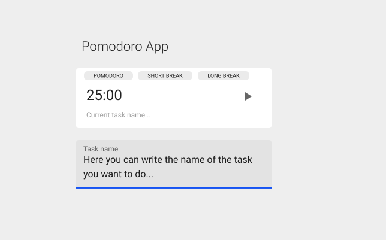

# Technical Assessment

At [Kredi](https://www.kredi.mx), We are focused on critical financial processes. That is why we want our development team to focus on quality code and best practices.

This is a small technical assessment for our open position as Sr. Frontend Sofware Developer. We encourage you to follow the rules and recomendations described above:

Rules:

- Be honest, do not copy code from Stack overflow, We all know programmers do that, but this time we want to evaluate your thinking process.
- Do not mention the company name in your repository.
- Apply best practices, var names, indentation, readability, SOLID, DRY, Design patterns, etc.
- Test your code, We strongly recommend Jest.
- Publish your code on Github || Gitlab, be careful about how you write your commit messages.
- Deploy your code to Heroku or Firebase, it takes no longer than 20 minutes!
- if you have any questions, do not hesitate to reach us, this is so important!
- Happy coding! :)

Recomendations:

- Use functional components.
- Use Redux + middlewares like Thunk or Sagas.
- Use Formik + Yup or equivalents.

## Part I

### Questions

Please add a file called `excercises.md` to your repo with your answers:

#### JS (ES6)

1. What is an arrow function? What are all its uses? How it differs from a normal function?

2. What is an generator function?

3. What is hoisting in JS?

4. What is a callback hell?

5. What is an event loop?


#### ReactJS

1. What is ReactDOM and what is the difference between ReactDOM and React?

2. What are the differences between a class component and functional component?

3. What is the difference between state and props?


## Part II
### CHALLENGE

Your mission is to make a small Pomodoro time tracking app.

> (if you do not know about the Pomodoro technique, please refer to [this link](https://francescocirillo.com/pages/pomodoro-technique))


+kudos If you use docker, that would be great and give extra points.

### CORE REQUIREMENTS

#### Pomodoro technique

```md
The core process of the Pomodoro Technique consists of 6 steps:

1. Choose a task you'd like to get done.

2. Set the Pomodoro for 25 minutes.

3. Work on the task until the Pomodoro rings.

4. When the Pomodoro rings, put a checkmark.

5. Take a short break (5 minutes)

6. Every 4 Pomodoros, take a longer break

```

Write an app with React with TypeScript that follow the user stories above:

- As a visitor, I want to create an account for the Pomodoro app, so that I become an active user.
    Acceptance Criteria:
      - Application needs my name, email, and password.
      - Duplicated emails are not allowed.
      - Validates email input.
- As an active user I want to see my home screen where I can see my Pomodoro timer.
    Acceptance Criteria:
      - My timer should have a large format (easy to see).

      - I should be able to start a Pomodoro timer.

      - I should be able to pause a Pomodoro.

      - I should be able to cancel a Pomodoro.

      - After my Pomodoro ends, a 5 minutes timer starts, indicating it is a short break.

      - After four Pomodoros, a 30 minutes timer starts, indicating it is a long break.
    This is an example of how the app might look like, however, you can design it.
    
- As an active user I want to be able to write what task am I working on.
- As an active user, If I want to close the window or tab, I want to see an alert preventing me, only if there is an active pomodoro.
- As an active user I want to see all my completed pomodoros in a list.
- As an active user I want to see statistics of my pomodoros.
    - I want to see my completed pomodoros counter.
    - I want to see total hours calculations, How many hours I've worked, how many hours I've rested.
    - As an active user I want to download my tasks report.
